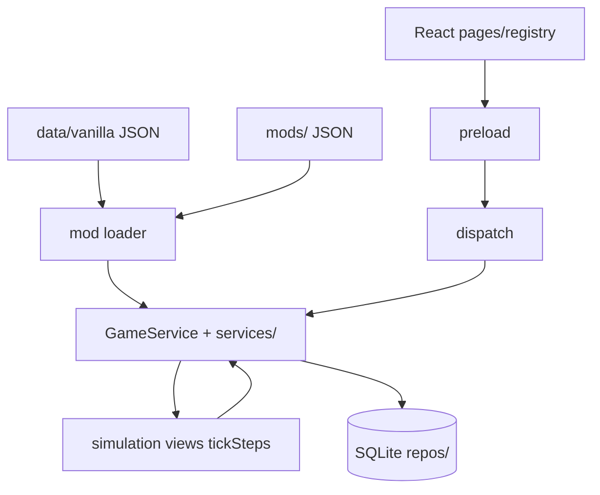

# Stellar Ledger

[](https://github.com/Beagle0913/Stellar-Ledger/actions/workflows/ci.yml)

Single-player galactic economy game in spreadsheet form. This repo is a vertical slice:
JSON mods, a pure TypeScript simulation, SQLite saves, and an Electron/React UI.

Repo: [github.com/Beagle0913/Stellar-Ledger](https://github.com/Beagle0913/Stellar-Ledger)  
Docs: [`docs/README.md`](docs/README.md)

## Play (Windows)

### Stable build (players — no Node required)

Download the newest **versioned release** (e.g. `v0.2.0`) from [Releases](https://github.com/Beagle0913/Stellar-Ledger/releases). Run `StellarLedger.exe`. Optional: verify the download with `StellarLedger.exe.sha256`.

The exe is portable. Copy it anywhere; on first launch it creates `data/`, `mods/`, and `saves/` next to itself.

**v0.2.0 save note:** Campaigns from v0.1.x used a 5-system galaxy. Those saves cannot load in v0.2.0 — start a new campaign for the 100-system galaxy.

### Rolling development build (bleeding edge)

Download **"Stellar Ledger (Latest)"** pre-release from [Releases](https://github.com/Beagle0913/Stellar-Ledger/releases). Built from every green `main` push. This is not the same as GitHub's "Latest" stable badge (prereleases cannot be marked latest).

### Build from clone (developers)

1. Double-click **`Setup.bat`** once — bootstraps Node into `.tools/node/` if needed, installs deps into `node_modules/`.
2. Double-click **`Build Game.bat`** to package, then **`Play.bat`** (offers to build if the exe is missing).

CI also uploads a 7-day [Actions artifact](https://github.com/Beagle0913/Stellar-Ledger/actions) as a fallback; [Releases](https://github.com/Beagle0913/Stellar-Ledger/releases) are the primary download.

## How to play

Time only moves when you tick. More detail in [`docs/DESIGN.md`](docs/DESIGN.md).

1. **Save / Load** — new campaign: name, scenario (Standard / Prospector / Barebones / Trade Focus), mod toggles.
2. **Dashboard** — credits, day, objectives. Tick 1 day, 7 days, or smart advance.
3. **Star Map → System → Planet** — world stats, buildings, NPC owners. Convoy arcs on the map.
4. **Production** — queue jobs. The planner panel checks if a chain is feasible from current stock (read-only).
5. **Market** — orders, quick trades, price chart with 7/30/90/all ranges.
6. **Logistics** — buy ships, run transport between systems.
7. **Objectives & contracts** — credits and faction standing.
8. Saves write on player actions and ticks. **Save Now** any time.

Helion Mining and Orion Refining are NPC corps with their own production, market listings, and hauls. You can buy from their sell orders like anyone else. Mods only apply to new campaigns; loaded saves keep their frozen definitions.

## What's in the box

Offline, local, no accounts. UI is tables and panels plus a 2D star map — no 3D. All content is JSON; vanilla is the built-in mod in `data/vanilla/`.

Scenario presets, production planner, price charts, multi-corp saves (schema v13), NPC industrial AI, regional stockpiles, population drift, event gating, explanation text on market moves, and a headless balance harness in CI.

| Content | Count |
|---------|-------|
| Items | 20 |
| Buildings | 12 |
| Recipes | 20 |
| Systems / planets | 100 / ~505 | `systems.json`, `planets.json`, `galaxy-meta.json` |
| Factions / events / objectives | 3 / 7 / 7 |
| Scenarios / NPC corps | 4 / 2 |

Stack: TypeScript, Electron, React, Vite, better-sqlite3, Zod, Vitest (~77 test files).

Contributor guide: [`docs/ARCHITECTURE.md`](docs/ARCHITECTURE.md) (layers, IPC registry, services split, scaffolds).

## Development

Node 22+ and pnpm (via Corepack):

```powershell
git clone https://github.com/Beagle0913/Stellar-Ledger.git
cd Stellar-Ledger
corepack pnpm install --frozen-lockfile
npm run rebuild:node
corepack pnpm verify
```

`postinstall` compiles native modules for Electron. Tests run on Node, so run `rebuild:node` after install. `pretest` repeats that if you just ran `dist` or the GUI.

```powershell
corepack pnpm run rebuild:electron   # before pnpm dev
corepack pnpm dev
corepack pnpm test
```

Useful scripts:

```powershell
corepack pnpm verify              # branding + galaxy check + typecheck + lint + test + balance
corepack pnpm run dist            # release/StellarLedger.exe
corepack pnpm balance             # economy CI gates
corepack pnpm run balance:report  # writes reports/balance/
corepack pnpm scaffold:ipc        # IPC wiring helper (verify / new method)
corepack pnpm scaffold:state      # persistence field checklist
```

Content authors: [`docs/MODDING.md`](docs/MODDING.md). Economy rules: [`docs/ECONOMY.md`](docs/ECONOMY.md).

## Packaging

`Setup.bat` then `Build Game.bat`, or `pnpm run dist`. Output: `release/StellarLedger.exe`.

The packaged exe seeds `data/` and `mods/` beside itself once. Your edits persist; delete a folder to reset. Live content always comes from disk beside the exe, not from the bundled seed.

Optional env vars:

| Variable | Effect |
|----------|--------|
| `GE_DEBUG_PATHS=1` | Log data/mods/saves paths |
| `GE_DEBUG=1` | Mirror actions to terminal |
| `GE_DEBUG_VERBOSE=1` | Per-tick headers |
| `GE_STRICT_SAVE=1` | Strict validation on load |

Debug page (dev builds only): activity log and economy inspector.

## Troubleshooting

| Problem | Fix |
|---------|-----|
| `NODE_MODULE_VERSION 127` vs `130` | Close the exe. `pnpm run dist` or `Build Game.bat`. For tests: `pnpm test` or `npm run rebuild:node`. |
| Tests fail after dev/dist | `pnpm test` — pretest rebuilds for Node. |
| `electron-rebuild failed` | Close `StellarLedger.exe` and retry. |
| Build can't overwrite files | Close all running exe instances. |
| `pnpm` not found | Run **`Setup.bat`** or `corepack enable` then `corepack pnpm …`. |
| Setup can't download Node | Check network/proxy; install Node.js 22+ from [nodejs.org](https://nodejs.org/) manually. |
| Portable exe won't start | Rebuild; check `release/verify-smoke-failure.log`. |
| Old save won't load (v0.2.0) | Start a new campaign — v0.1.x saves used the old 5-system galaxy. |

## Layout

```
src/shared/           Types, constants, explanations, ipcMethods, vanillaLoader
src/simulation/       Tick (tickSteps), market, NPC AI (npc/shared), views/
src/database/         SQLite, migrations, repositories/ (meta, corp, defs, entity)
src/mods/             Loader, mergeMods, mergeValidation, Zod schemas
src/balance/          Headless economy runs
src/main/             Electron main, GameService, services/, commands/, dispatch
src/renderer/         React UI, pages/registry.ts, components/
data/vanilla/         Base mod
mods/                 External mods
tests/                Vitest (Node + jsdom renderer)
docs/                 Design, architecture, economy, modding, …
```

Pages are registered in `src/renderer/pages/registry.ts` (Dashboard, Star Map, System, Planet, Market, Production, Inventory, Logistics, Mods, Save/Load, Debug in dev).

## IPC

New `GameApi` methods are registered in **`src/shared/ipcMethods.ts`** (`IPC_METHOD_SPECS`). Preload builds the bridge from that list; dispatch still maps each name to `GameService`.

Checklist:

1. `src/shared/ipcMethods.ts` — add `{ name, hasPayload }`
2. `src/shared/types/api.ts` — type signature
3. `src/main/ipcSchemas.ts` (if payload)
4. `src/main/services/` — implement on the right service module
5. `src/main/dispatch.ts` — switch case
6. `tests/ipc.test.ts` — `payloadFor()` entry

```bash
pnpm scaffold:ipc myMethod --payload
pnpm scaffold:ipc verify
```

Optional: `pnpm scaffold:ipc myMethod --payload --write` appends registry, dispatch, api stub, and test hints.

Renderer never imports Node — only `window.api`.

## Architecture



Simulation is pure TS on in-memory `GameState`. Saves freeze mod and scenario definitions at campaign creation.

## Contributing

Branch from `main`, run `pnpm verify`, open a PR. Read [`docs/ARCHITECTURE.md`](docs/ARCHITECTURE.md) before adding IPC, pages, tick steps, or save fields. CI runs `check` (ubuntu: typecheck, lint, test) and `dist-windows` (portable exe artifact, pnpm).

[`docs/ROADMAP.md`](docs/ROADMAP.md) · [`CHANGELOG.md`](CHANGELOG.md)

## License

[MIT](LICENSE)
