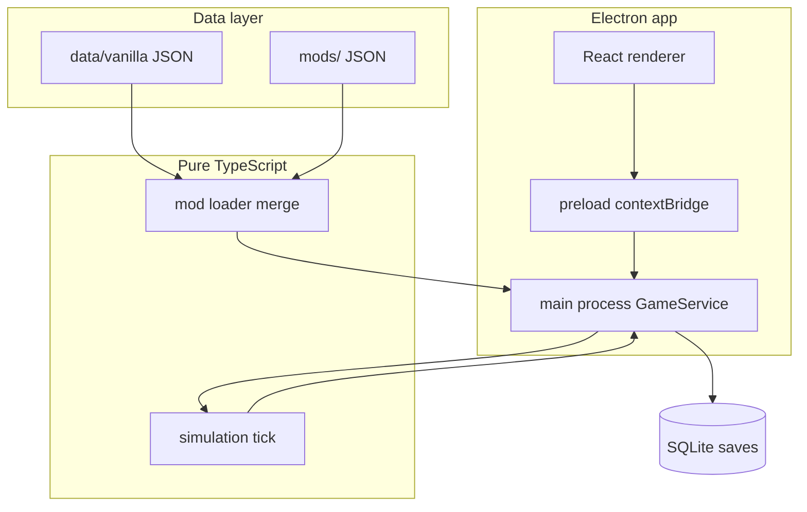

# Stellar Ledger — Galactic Economy Prototype

[](https://github.com/Beagle0913/Stellar-Ledger/actions/workflows/ci.yml)

An original, moddable, single-player **galactic economy / spreadsheet strategy** game.
This repository is a **vertical slice prototype**: it proves the architecture end to
end (data-driven mods → simulation core → SQLite saves → Electron/React UI) rather
than shipping the full game.

**Repository:** [github.com/Beagle0913/Stellar-Ledger](https://github.com/Beagle0913/Stellar-Ledger) · **Docs index:** [`docs/README.md`](docs/README.md)

---

## Contents

- [Quick start (play)](#quick-start-windows--just-play)
- [How to play](#how-to-play)
- [What you get today](#what-you-get-today)
- [Clone and develop](#clone-and-develop-any-machine)
- [Commands](#commands)
- [Packaging a portable exe](#packaging-a-portable-windows-exe)
- [Troubleshooting](#troubleshooting)
- [Project layout](#project-layout)
- [Architecture](#architecture)
- [Contributing](#contributing)
- [Documentation](#documentation)
- [License](#license)

---

## Quick start (Windows — just play)

You only need Node.js **once** to build the game. After that, play with a single exe.

1. **Build** — double-click **`Build Game.bat`** (installs deps on first run, then packages).
2. **Play** — double-click **`Play.bat`**, or run **`release\GalacticEconomy.exe`** directly.

Copy `release\GalacticEconomy.exe` anywhere you like (Desktop, USB stick, etc.). On first
launch it creates editable `data/`, `mods/`, and `saves/` folders **beside the exe**.

> No install wizard, no registry entries — one portable exe.

**Don't want to build?** After a push to `main`, GitHub Actions builds a portable exe.
Open [Actions](https://github.com/Beagle0913/Stellar-Ledger/actions) → latest green
`dist-windows` run → download the **GalacticEconomy-portable** artifact.

---

## How to play

Stellar Ledger is a **turn-based planner**: time only advances when you tick.

For design rationale and the full core loop, see [`docs/DESIGN.md`](docs/DESIGN.md).

1. **Save / Load** — create a **New Campaign**: pick a name, choose a **scenario** (Standard, Prospector, Barebones, Trade Focus), and toggle mods before starting.
2. **Dashboard** — see credits, day, objectives, and contextual hints. Use **Run 1 Day Tick**,
   **Run 7 Days**, or smart advance (jump to next production, transport, or change).
3. **Explore** — **Star Map** → **System** → **Planet** for world stats, buildings, and foreign NPC owners. The Star Map shows player and NPC convoy arcs.
4. **Produce** — queue jobs on the **Production** page; use the **Planner** panel to check whether a target item chain is feasible from current stock (read-only — it does not queue jobs).
5. **Trade** — place orders or use quick buy/sell on the **Market** page; expand the **price chart** (7 / 30 / 90 / all ranges with hover tooltip).
6. **Ship goods** — buy ships and dispatch **Logistics** transport between systems.
7. **Progress** — complete **objectives** and **contracts** for credits and faction standing.
8. **Save** — the game autosaves on actions and ticks; use **Save Now** anytime.

Tips:

- Read the “why” lines under market moves, events, and objectives — they explain what happened.
- NPC corporations (Helion Mining, Orion Refining) run their own production, list surplus on markets, and ship goods between systems — you can trade against their orders like any other seller.
- Enable/disable mods on the **Mods** page before a **new** campaign; loaded saves keep frozen definitions and scenario snapshots.
- Edit `data/` and `mods/` beside the portable exe (or in the project root when running from source).

---

## What you get today

- **Single-player, fully local.** No server, no cloud, no accounts, no telemetry.
- **Spreadsheet-first UI.** Dense tables and panels plus a 2D **Star Map** trade-network view. No 3D.
- **Data-driven & moddable.** All content lives in JSON; the base game is a built-in mod called `vanilla`.
- **Scenario starts.** Four named presets (Standard, Prospector, Barebones, Trade Focus) with difficulty badges and frozen scenario snapshots in each save.
- **Campaign loop.** Objectives, contract board, faction reputation, fleet logistics, production queues, quick market trades, and smart time advance on the Dashboard.
- **Planning tools.** Interactive **price charts** on the Market page and a read-only **production planner** for chain feasibility from current stock.
- **Living NPC economy.** Two vanilla NPC corporations with autonomous production, corp-owned market listings, and inter-system logistics — alongside abstract regional liquidity (`NPC_OWNER`).
- **Economy depth.** Regional stockpiles, population dynamics, cross-system trade convoys, and player-facing “why did this happen?” explanations.
- **Saves & mods.** SQLite campaigns (schema v13) with frozen mod and scenario snapshots; enable/disable mods per new campaign; reload JSON from disk in dev.

| Vanilla content | Count |
|-----------------|-------|
| Items | 20 |
| Buildings | 12 |
| Recipes | 20 |
| Star systems | 5 |
| Planets | 15 |
| Factions | 3 |
| Events | 7 |
| Objectives | 7 |
| Scenarios | 4 |
| NPC corporations | 2 |

> **Tech:** TypeScript (strict) · Electron · React · Vite (`electron-vite`) · better-sqlite3 · Zod · Vitest

---

## Clone and develop (any machine)

**Requirements:** Node.js **22+** and `pnpm` (via Corepack, which ships with Node).

```powershell
git clone https://github.com/Beagle0913/Stellar-Ledger.git
cd Stellar-Ledger

# Install dependencies (native modules compile during postinstall)
corepack pnpm install --frozen-lockfile

# postinstall targets Electron's ABI — rebuild for Node before tests
npm run rebuild:node

# Full health check (typecheck + lint + test + balance)
corepack pnpm verify
```

If `pnpm` is already on your `PATH`, you can drop the `corepack` prefix. `npm` also works as a fallback (`npm install`, `npm test`, …).

pnpm blocks native build scripts by default; this repo pre-approves the required ones in
`pnpm-workspace.yaml` (`better-sqlite3`, `electron`, `esbuild`), so a plain install builds them automatically.

### Run from source

```powershell
# Rebuild better-sqlite3 for Electron (required once before GUI)
corepack pnpm run rebuild:electron

# Development (Vite HMR + Electron)
corepack pnpm dev
```

After using the GUI, run tests with:

```powershell
corepack pnpm test
```

**`pretest` runs automatically** and rebuilds for Node if `better-sqlite3` was left on the Electron ABI after `dist` or `rebuild:electron`. You can also run `npm run rebuild:node` manually.

> **Why two ABIs?** Vitest runs on Node; the app runs on Electron. `better-sqlite3` is a native addon compiled for one ABI at a time. The rebuild scripts flip between them.

### Pick your path

| I want to… | Start here |
|------------|------------|
| Play without cloning | `Build Game.bat` → `Play.bat` |
| Code on another PC | [Clone and develop](#clone-and-develop-any-machine) → `pnpm verify` |
| Hack game content | [`docs/MODDING.md`](docs/MODDING.md) + `data/vanilla/` |
| Understand the economy | [`docs/ECONOMY.md`](docs/ECONOMY.md) |
| Add an IPC feature | [Adding a new IPC endpoint](#adding-a-new-ipc-endpoint) below |
| Read all docs | [`docs/README.md`](docs/README.md) |

---

## Commands

```powershell
corepack pnpm install          # Install dependencies
corepack pnpm verify           # typecheck + lint + test + balance (recommended before push)
corepack pnpm test             # Full Vitest suite (pretest fixes Node ABI if needed)
corepack pnpm typecheck        # Strict TypeScript check
corepack pnpm lint             # ESLint
corepack pnpm build            # Build main / preload / renderer → out/
corepack pnpm dev              # Dev desktop app (HMR)
corepack pnpm play             # Production build from source (no packaging)
corepack pnpm run play:portable # Launch packaged exe (after dist)
corepack pnpm run dist         # Full portable exe pipeline
corepack pnpm start            # Preview a production build
corepack pnpm balance          # Headless balance CI gates
corepack pnpm run balance:report  # Balance run + reports in reports/balance/
corepack pnpm run rebuild:electron  # Native module → Electron ABI
corepack pnpm run rebuild:node      # Native module → Node ABI (tests)
corepack pnpm scaffold:ipc     # Print IPC wiring snippets
```

---

## Packaging a portable Windows .exe

```powershell
corepack pnpm run dist
```

Or double-click **`Build Game.bat`** on Windows.

Pipeline (`scripts/dist.mjs`): stop running exe → rebuild `better-sqlite3` for Electron → build → package → verify native module + smoke launch → restore Node ABI for tests.

Output:

```
release/GalacticEconomy.exe
```

### First-run folder behavior (editable content)

The portable exe ships read-only **seed** copies of `data/` and `mods/` inside itself.
The first time you run it, the game creates editable folders beside the exe:

```
GalacticEconomy.exe
data/      <- editable game content (incl. data/vanilla)
mods/      <- drop external mods here
saves/     <- your campaign .sqlite files
```

- Live content is read from these folders — not from the bundled seed (seed is only used to create them once).
- **Seed-if-missing:** your edits are never overwritten on relaunch. Delete a folder to reset defaults.
- Move the `.exe` to a new folder to get a fresh seed there.

**Debug env vars (optional):**

| Variable | Effect |
|----------|--------|
| `GE_DEBUG_PATHS=1` | Log resolved data/mods/saves paths and seeding decisions |
| `GE_DEBUG=1` | Mirror simulation and player actions to the terminal |
| `GE_DEBUG_VERBOSE=1` | Include per-tick header lines (noisier) |
| `GE_STRICT_SAVE=1` | Strict save validation on load |

The in-game **Debug** page (dev builds only) shows the full persisted activity log.

---

## Troubleshooting

| Problem | Fix |
|---------|-----|
| `NODE_MODULE_VERSION 127` vs `130` | Close `GalacticEconomy.exe`. Run **`Build Game.bat`** or `pnpm run dist`. For tests: `pnpm test` (pretest auto-rebuilds) or `npm run rebuild:node`. |
| Tests fail after `pnpm dev` / `dist` | Run `corepack pnpm test` — pretest rebuilds for Node. |
| `electron-rebuild failed` | Game exe still running — close it and retry `rebuild:electron`. |
| Build can't overwrite files | Close all `GalacticEconomy.exe` instances. |
| Fresh clone, tests crash on Linux CI | Run `npm run rebuild:node` after install (CI does this automatically). |
| `pnpm` not found | Use `corepack pnpm …` or `corepack enable` (Node 22+). |
| Portable exe won't start | Rebuild with `Build Game.bat`; check `release/verify-smoke-failure.log` if verify failed locally. |

---

## Project layout

```
src/
  shared/        Domain types, ids, constants, explanations (no Node/React)
  simulation/    Pure deterministic game logic (tick, production, market, …)
  database/      SQLite schema, migrations, repositories, save manager
  mods/          Mod types, Zod schemas, loader, validation, merge
  balance/       Headless balance harness and report formatters
  main/          Electron main process + preload (contextBridge IPC)
  renderer/      React app: pages/ and components/
data/vanilla/    Base game content (the built-in "vanilla" mod)
mods/            External mods (see docs/README.md)
saves/           Local SQLite campaign files (dev; gitignored except .gitkeep)
tests/           Vitest suites (unit + renderer smoke tests)
docs/            Design, economy, modding, persistence, balance, roadmap
scripts/         Build, dist, verify, balance-report, IPC scaffold helpers
```

### UI pages

Dashboard · Star Map · System · Planet · Market · Production · Inventory · Logistics · Mods · Save / Load · Debug (dev only)

### What this slice implements

1. **Shared contracts** (`src/shared/types/`) — `definitions`, `state`, `views`, `api`; every layer uses the IPC `GameApi` surface.
2. **Mod system** — Zod-validated JSON, dependency resolution, merge, reference-integrity checks.
3. **Vanilla content** — see table above; plus contract templates, economic profiles, scenarios, and NPC corporation seeds.
4. **Simulation core** (`src/simulation`) — pure TS: production, markets, logistics, extraction, events, NPC corporation AI (production, market, logistics), deterministic daily tick.
5. **Database** (`src/database`) — SQLite schema v13, migrations, frozen mod/scenario snapshots, multi-corporation save/load.
6. **Electron main + preload** — typed IPC bridge; renderer never touches Node.
7. **React renderer** — all pages above, price charts, production planner, explanations, autosave status.
8. **Tests + docs** — 330+ headless Vitest tests plus balance CI gates; see [`docs/README.md`](docs/README.md).

### Adding a new IPC endpoint

Every `GameApi` method must be wired in six places. `tests/ipc.test.ts` enforces parity between `GameApi` and `HANDLED_METHODS` at compile time (via `payloadFor()`).

| Step | File | What to add |
|------|------|-------------|
| 1 | `src/shared/types/api.ts` | Return/args types + `GameApi` method signature |
| 2 | `src/main/ipcSchemas.ts` | Zod schema (only if the method takes a payload) |
| 3 | `src/main/gameService.ts` | Implementation (delegate to simulation / view query) |
| 4 | `src/main/dispatch.ts` | Entry in `HANDLED_METHODS` + `switch` case |
| 5 | `src/main/preload.ts` | `contextBridge` `api` entry |
| 6 | `tests/ipc.test.ts` | `payloadFor()` sample (missing key = TypeScript error) |

Optional renderer follow-ups: page/component call, `tests/renderer/mockApi.ts` default, smoke test in `tests/renderer/pages.smoke.test.tsx`.

```bash
corepack pnpm scaffold:ipc myNewMethod --payload   # method with args
corepack pnpm scaffold:ipc myNewMethod             # no-arg method
corepack pnpm scaffold:ipc verify                  # GameApi vs HANDLED_METHODS
```

---

## Architecture



**Rules:**

- The **renderer never imports Node** — only the typed `window.api` bridge.
- The **simulation core** has no Electron, React, or database imports; it runs on in-memory `GameState`.
- **Saves freeze** mod definitions at campaign creation so later content edits cannot corrupt old campaigns.

---

## Contributing

1. Fork / branch from `main`.
2. `corepack pnpm install` → `npm run rebuild:node` → `corepack pnpm verify`.
3. Push — GitHub Actions runs the same checks plus a Windows portable build.

| CI job | Runner | What it does |
|--------|--------|--------------|
| `check` | ubuntu-latest | typecheck, lint, test |
| `dist-windows` | windows-latest | `npm run dist`, uploads `GalacticEconomy.exe` artifact |

See [`docs/ROADMAP.md`](docs/ROADMAP.md) for milestone status and [`CHANGELOG.md`](CHANGELOG.md) for release notes.

---

## Documentation

Full index and reading order: [`docs/README.md`](docs/README.md)

| Doc | Topic |
|-----|-------|
| [`docs/DESIGN.md`](docs/DESIGN.md) | Game design and architecture |
| [`docs/ECONOMY.md`](docs/ECONOMY.md) | Economic model and tick pipeline |
| [`docs/MODDING.md`](docs/MODDING.md) | Creating and validating mods |
| [`docs/PERSISTENCE.md`](docs/PERSISTENCE.md) | Saves, schema, adding fields |
| [`docs/BALANCE_ANALYTICS.md`](docs/BALANCE_ANALYTICS.md) | Headless balance runs |
| [`docs/ROADMAP.md`](docs/ROADMAP.md) | Milestones and planned work |
| [`CHANGELOG.md`](CHANGELOG.md) | Release notes |

---

## License

[MIT](LICENSE)
