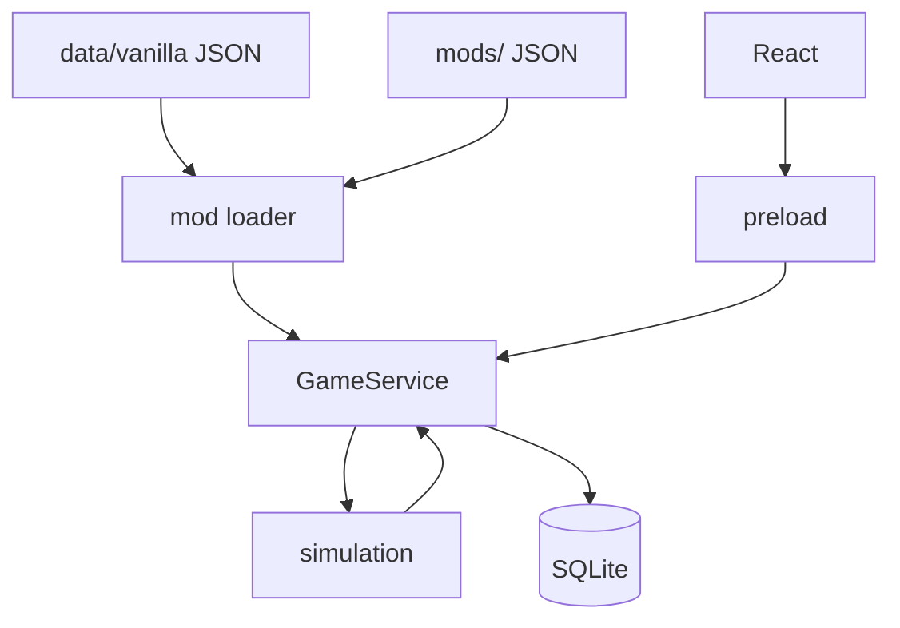

# Stellar Ledger

[](https://github.com/Beagle0913/Stellar-Ledger/actions/workflows/ci.yml)

Single-player galactic economy game in spreadsheet form. This repo is a vertical slice:
JSON mods, a pure TypeScript simulation, SQLite saves, and an Electron/React UI.

Repo: [github.com/Beagle0913/Stellar-Ledger](https://github.com/Beagle0913/Stellar-Ledger)  
Docs: [`docs/README.md`](docs/README.md)

## Play (Windows)

You need Node once to build. After that it's just an exe.

1. Run `Build Game.bat` (installs deps the first time, then packages).
2. Run `Play.bat`, or open `release\GalacticEconomy.exe`.

The exe is portable. Copy it anywhere; on first launch it creates `data/`, `mods/`, and `saves/` next to itself.

CI also builds a portable exe on every green `main` push. Grab it from [Actions](https://github.com/Beagle0913/Stellar-Ledger/actions) → latest `dist-windows` run → **GalacticEconomy-portable** artifact.

## How to play

Time only moves when you tick. More detail in [`docs/DESIGN.md`](docs/DESIGN.md).

1. **Save / Load** — new campaign: name, scenario (Standard / Prospector / Barebones / Trade Focus), mod toggles.
2. **Dashboard** — credits, day, objectives. Tick 1 day, 7 days, or smart advance.
3. **Star Map → System → Planet** — world stats, buildings, NPC owners. Convoy arcs on the map.
4. **Production** — queue jobs. The planner panel checks if a chain is feasible from current stock (read-only).
5. **Market** — orders, quick trades, price chart with 7/30/90/all ranges.
6. **Logistics** — buy ships, run transport between systems.
7. **Objectives & contracts** — credits and faction standing.
8. Saves write on player actions and ticks. **Save Now** any time.

Helion Mining and Orion Refining are NPC corps with their own production, market listings, and hauls. You can buy from their sell orders like anyone else. Mods only apply to new campaigns; loaded saves keep their frozen definitions.

## What's in the box

Offline, local, no accounts. UI is tables and panels plus a 2D star map — no 3D. All content is JSON; vanilla is the built-in mod in `data/vanilla/`.

Scenario presets, production planner, price charts, multi-corp saves (schema v13), NPC industrial AI, regional stockpiles, population drift, event gating, explanation text on market moves, and a headless balance harness in CI.

| Content | Count |
|---------|-------|
| Items | 20 |
| Buildings | 12 |
| Recipes | 20 |
| Systems / planets | 5 / 15 |
| Factions / events / objectives | 3 / 7 / 7 |
| Scenarios / NPC corps | 4 / 2 |

Stack: TypeScript, Electron, React, Vite, better-sqlite3, Zod, Vitest (~330 tests).

## Development

Node 22+ and pnpm (via Corepack):

```powershell
git clone https://github.com/Beagle0913/Stellar-Ledger.git
cd Stellar-Ledger
corepack pnpm install --frozen-lockfile
npm run rebuild:node
corepack pnpm verify
```

`postinstall` compiles native modules for Electron. Tests run on Node, so run `rebuild:node` after install. `pretest` repeats that if you just ran `dist` or the GUI.

```powershell
corepack pnpm run rebuild:electron   # before pnpm dev
corepack pnpm dev
corepack pnpm test
```

Useful scripts:

```powershell
corepack pnpm verify              # typecheck + lint + test + balance
corepack pnpm run dist            # release/GalacticEconomy.exe
corepack pnpm balance             # economy CI gates
corepack pnpm run balance:report  # writes reports/balance/
corepack pnpm scaffold:ipc        # IPC wiring helper
```

Content authors: [`docs/MODDING.md`](docs/MODDING.md). Economy rules: [`docs/ECONOMY.md`](docs/ECONOMY.md).

## Packaging

`pnpm run dist` or `Build Game.bat`. Output: `release/GalacticEconomy.exe`.

The packaged exe seeds `data/` and `mods/` beside itself once. Your edits persist; delete a folder to reset. Live content always comes from disk beside the exe, not from the bundled seed.

Optional env vars:

| Variable | Effect |
|----------|--------|
| `GE_DEBUG_PATHS=1` | Log data/mods/saves paths |
| `GE_DEBUG=1` | Mirror actions to terminal |
| `GE_DEBUG_VERBOSE=1` | Per-tick headers |
| `GE_STRICT_SAVE=1` | Strict validation on load |

Debug page (dev builds only): activity log and economy inspector.

## Troubleshooting

| Problem | Fix |
|---------|-----|
| `NODE_MODULE_VERSION 127` vs `130` | Close the exe. `pnpm run dist` or `Build Game.bat`. For tests: `pnpm test` or `npm run rebuild:node`. |
| Tests fail after dev/dist | `pnpm test` — pretest rebuilds for Node. |
| `electron-rebuild failed` | Close `GalacticEconomy.exe` and retry. |
| Build can't overwrite files | Close all running exe instances. |
| `pnpm` not found | `corepack pnpm …` or `corepack enable`. |
| Portable exe won't start | Rebuild; check `release/verify-smoke-failure.log`. |

## Layout

```
src/shared/       Types, constants, explanations
src/simulation/   Tick, production, market, NPC AI, …
src/database/     SQLite, migrations, save manager
src/mods/         Loader, Zod schemas, merge
src/balance/      Headless economy runs
src/main/         Electron main + preload
src/renderer/     React UI
data/vanilla/     Base mod
mods/             External mods
tests/            Vitest
docs/             Design, economy, modding, …
```

Pages: Dashboard, Star Map, System, Planet, Market, Production, Inventory, Logistics, Mods, Save/Load, Debug (dev only).

## IPC

New `GameApi` methods need wiring in six places; `tests/ipc.test.ts` catches drift via `payloadFor()`:

1. `src/shared/types/api.ts`
2. `src/main/ipcSchemas.ts` (if payload)
3. `src/main/gameService.ts`
4. `src/main/dispatch.ts`
5. `src/main/preload.ts`
6. `tests/ipc.test.ts`

```bash
pnpm scaffold:ipc myMethod --payload
pnpm scaffold:ipc verify
```

Renderer never imports Node — only `window.api`.

## Architecture



Simulation is pure TS on in-memory `GameState`. Saves freeze mod and scenario definitions at campaign creation.

## Contributing

Branch from `main`, run `pnpm verify`, open a PR. CI runs `check` (ubuntu: typecheck, lint, test) and `dist-windows` (portable exe artifact).

[`docs/ROADMAP.md`](docs/ROADMAP.md) · [`CHANGELOG.md`](CHANGELOG.md)

## License

[MIT](LICENSE)
