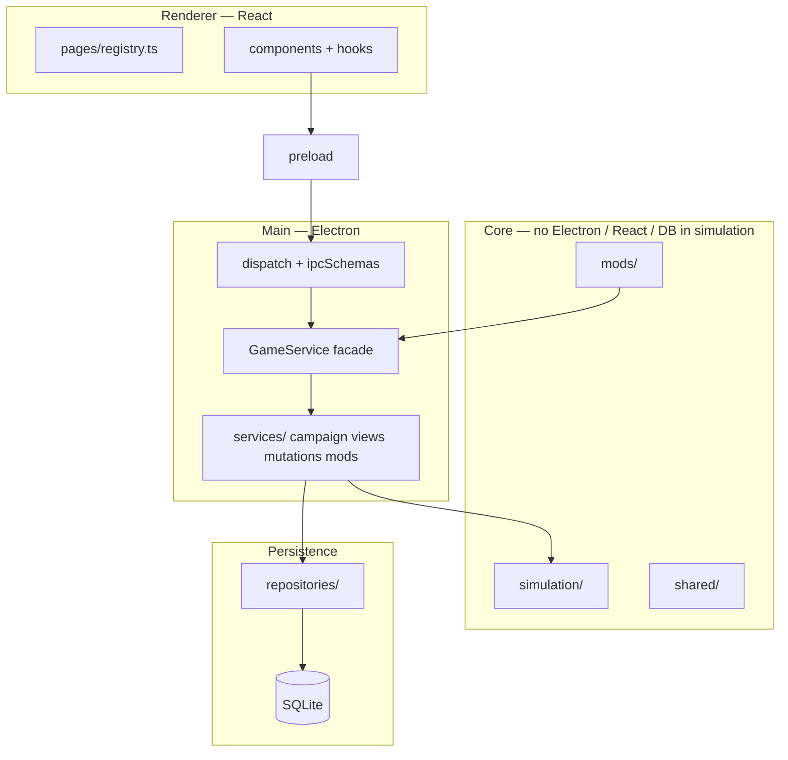

# Architecture (contributors)

How the codebase is organized and how to extend it without fighting the layers. Player-facing design lives in [DESIGN.md](DESIGN.md); economy rules in [ECONOMY.md](ECONOMY.md).

## Layers

| Layer | Path | May import |
|-------|------|------------|
| Shared | `src/shared/` | Shared only |
| Simulation | `src/simulation/` | Shared, simulation |
| Database | `src/database/` | Shared, database, simulation (bootstrap only) |
| Mods | `src/mods/` | Shared, mods |
| Main | `src/main/` | All backend layers |
| Renderer | `src/renderer/` | Shared types via IPC only (`window.api`) |
| Balance | `src/balance/` | Shared, simulation, balance — no DB/Electron/renderer |

ESLint enforces these boundaries. Run `pnpm lint` before opening a PR.

## Version and content

- **`GAME_VERSION`** in `src/shared/constants.ts` (currently `0.2.0`) — written to new saves as `game_version`; use in mod manifests as `"gameVersion": "0.2.x"`.
- **Vanilla content** — `data/vanilla/`; load via `loadVanillaDefinitions()` in `src/shared/vanillaLoader.ts` (tests and balance harness share this).
- **Galaxy ids** — procedural home system/planet and NPC placement come from `data/vanilla/galaxy-meta.json`, not hardcoded names in logic.

## Simulation

Pure TypeScript on in-memory `GameState`. No SQLite, Electron, or React.

| Module | Role |
|--------|------|
| `tick.ts` + `tickSteps.ts` | Daily pipeline; steps registered in `TICK_STEPS` (see [ECONOMY.md](ECONOMY.md)) |
| `views/` | Read models for UI (`buildDashboard`, `buildMarketView`, …); barrel re-export in `viewQueries.ts` |
| `resolveNames.ts` | Display names via `stateIndex` O(1) lookups |
| `stateIndex.ts` | Cached maps for large galaxy scale |
| `npc/shared.ts` | Shared NPC AI helpers; tuning from `economyConfig` |
| `eventRegistry.ts`, `progressionRegistry.ts` | Closed unions for event/objective/contract *types* |

**Adding a tick step:** register in `src/simulation/tickSteps.ts`, document order in `ECONOMY.md`, add or extend tests in `tests/tick.test.ts`.

**Adding a mechanic type** (new event trigger, objective type, etc.): extend types in `shared/types/definitions.ts`, Zod in `modSchemas.ts`, handler in the matching registry, explanation strings if player-visible, [MODDING.md](MODDING.md) examples, tests.

Do not use `state.definitions.*.find()` in hot paths — use `stateIndex` or `resolveNames`. `tests/architecture.test.ts` guards against regressions.

## Main process and IPC

Single channel: `game:invoke` (`IPC_CHANNEL` in constants).

| File | Role |
|------|------|
| `src/shared/ipcMethods.ts` | **Registry** — `IPC_METHOD_SPECS` (`name`, `hasPayload`); derives `HANDLED_METHODS` |
| `src/shared/types/api.ts` | `GameApi` interface (source of truth for types) |
| `src/main/preload.ts` | Builds `window.api` from `IPC_METHOD_SPECS` |
| `src/main/dispatch.ts` | Routes method → `GameService` (switch cases) |
| `src/main/ipcSchemas.ts` | Zod payloads |
| `src/main/gameService.ts` | Thin facade |
| `src/main/services/` | `campaignLifecycle`, `gameViews`, `gameMutations`, `modService` |
| `src/main/commands/` | Player mutations → simulation + persist |
| `tests/ipc.test.ts` | `payloadFor()` must cover every `GameApi` method (compile-time exhaustiveness) |

**Adding an IPC method:**

1. `pnpm scaffold:ipc myMethod [--payload]` — prints or `--write` appends registry, dispatch, api stub, test hint
2. Implement in the appropriate `services/` module + command/simulation code
3. `pnpm scaffold:ipc verify`
4. Extend `payloadFor()` in `tests/ipc.test.ts`
5. Add renderer mock default in `tests/renderer/mockApi.ts` if UI-facing

Errors crossing IPC use `GameError` + `ErrorCode` (`src/shared/errors.ts`). Unexpected throws become `INTERNAL`.

## Renderer

| Module | Role |
|--------|------|
| `pages/registry.ts` | Built-in pages: `id`, `label`, `component`, `showInNav`, optional `devOnly` |
| `App.tsx` | Nav + routing from registry |
| `hooks.ts` | `useCampaignAsync`, `useApiMutation`, `useTickControls` — errors via `formatApiErrorMessage` |
| `components/` | Reusable UI (`DataTable`, `TickControlsPanel`, `MarketOrderForm`, …) |

**Adding a page:** new file under `pages/`, register in `registry.ts`, extend `PageId` in `context.ts`, add IPC/view code as needed. Mod-injected pages are not supported yet ([ROADMAP.md](ROADMAP.md)).

Import style: renderer uses extensionless imports (`'../api'`); Node bundles (main, simulation, database) use `.js` suffixes for ESM — keep each layer consistent.

## Persistence

See [PERSISTENCE.md](PERSISTENCE.md). Repositories split by concern (barrel: `worldRepo.ts`):

| File | Role |
|------|------|
| `metaRepo.ts` | `campaign_meta`, scenario snapshot columns |
| `corpRepo.ts` | `corporations` table |
| `definitionsRepo.ts` | Frozen defs at campaign creation |
| `entityRepo.ts` | Buildings, ships, events log, activity log blobs |

**Adding mutable state:** `pnpm scaffold:state myField` for checklist; follow PR template persistence section.

## Mods

Loader → merge → validate → freeze into save on new campaign. Merge rules in `mergeMods.ts`; cross-reference checks in `mergeValidation.ts`. Author guide: [MODDING.md](MODDING.md).

## Tests

~77 Vitest files under `tests/`. Node project for simulation/IPC/DB; jsdom for renderer smoke and interaction tests.

| Area | Examples |
|------|----------|
| IPC contract | `ipc.test.ts` |
| Architecture guard | `architecture.test.ts` |
| Simulation unit | `market.test.ts`, `extraction.test.ts`, `stateIndex.test.ts` |
| Renderer | `renderer/pages.smoke.test.tsx`, `renderer/pageInteractions.test.tsx` |
| Balance CI | `tests/balance/` via `pnpm balance` |

Shared test helpers: `tests/helpers.ts` (`newGame()`, `getHomeSystemId()`, …).

## Scaffold scripts

| Command | Purpose |
|---------|---------|
| `pnpm scaffold:ipc verify` | GameApi ↔ ipcMethods ↔ dispatch |
| `pnpm scaffold:ipc <name> [--payload] [--write]` | New IPC method boilerplate |
| `pnpm scaffold:state verify` | Print current schema version + doc links |
| `pnpm scaffold:state <fieldName>` | Mutable state field checklist |

## Related docs

- [DESIGN.md](DESIGN.md) — product scope and loop  
- [ECONOMY.md](ECONOMY.md) — tick order and NPC tuning  
- [MODDING.md](MODDING.md) — JSON content  
- [PERSISTENCE.md](PERSISTENCE.md) — saves and migrations  
- [BALANCE_ANALYTICS.md](BALANCE_ANALYTICS.md) — headless economy runs  
- [ROADMAP.md](ROADMAP.md) — milestone status  
